## Lab 1: Review numpy, scipy, matplotlib and Riemann Sum

### Numpy

A powerful library for numerical computing in Python. It provides support for large, multi-dimensional arrays and matrices, along with a collection of mathematical functions to operate on these arrays.

#### Load in NumPy (remember to install numpy first)


```python
import numpy as np
```

#### The Basics


```python
a = np.array([1,2,3], dtype='int32')
print(a)
```

    [1 2 3]
    


```python
b = np.array([[9.0,8.0,7.0],[6.0,5.0,4.0]])
print(b)
```

    [[9. 8. 7.]
     [6. 5. 4.]]
    


```python
# Get Dimension
print('a', a.ndim)
print('b', b.ndim)
```

    a 1
    b 2
    


```python
# Get Shape
b.shape
```


    (2, 3)


```python
# Get Type
a.dtype
```


    dtype('int32')


```python
# Get Size
a.itemsize
```


    4


```python
# Get total size
a.nbytes
```


    12


```python
# Get number of elements
a.size
```


    3


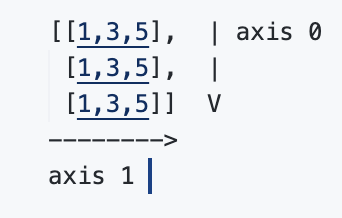

#### Accessing/Changing specific elements, rows, columns, etc


```python
c = np.array([[1,2,3,4,5,6,7],[8,9,10,11,12,13,14]])
print(c)
```

    [[ 1  2  3  4  5  6  7]
     [ 8  9 10 11 12 13 14]]
    


```python
# Get a specific element [r, c]
c[1, 5]
```


    13


```python
# Get a specific row 
c[0, :]
```


    array([1, 2, 3, 4, 5, 6, 7])


```python
# Get a specific column
c[:, 2]
```


    array([ 3, 10])


```python
# Getting a little more fancy [startindex:endindex:stepsize]
c[0, 1:-1:2]
```


    array([2, 4, 6])


```python
c[1,5] = 20

c[:,2] = [1,2]
print(a)
```

    [1 2 3]
    

*3-d example


```python
d = np.array([[[1,2],[3,4]],[[5,6],[7,8]]])
print(b)
```

    [[9. 8. 7.]
     [6. 5. 4.]]
    


```python
# Get specific element (work outside in)
d[0,1,1]
```


    4


#### Initializing Different Types of Arrays


```python
# All 0s matrix
np.zeros((2,3))
```


    array([[0., 0., 0.],
           [0., 0., 0.]])


```python
# All 1s matrix
np.ones((4,2,2), dtype='int32')
```


    array([[[1, 1],
            [1, 1]],
    
           [[1, 1],
            [1, 1]],
    
           [[1, 1],
            [1, 1]],
    
           [[1, 1],
            [1, 1]]])


```python
# Any other number
np.full((2,2), 99)
```


    array([[99, 99],
           [99, 99]])


```python
# Any other number (full_like)
np.full_like(a, 4)
```


    array([4, 4, 4])


```python
# Random decimal numbers
np.random.rand(4,2)
```


    array([[0.46877425, 0.96008686],
           [0.11364688, 0.9829674 ],
           [0.71100609, 0.58516204],
           [0.71586962, 0.55613164]])


```python
# Random Integer values
np.random.randint(-4,8, size=(3,3))
```


    array([[ 2,  7,  2],
           [-2,  7,  5],
           [ 3, -4, -1]])


```python
# The identity matrix
np.identity(5)
```


    array([[1., 0., 0., 0., 0.],
           [0., 1., 0., 0., 0.],
           [0., 0., 1., 0., 0.],
           [0., 0., 0., 1., 0.],
           [0., 0., 0., 0., 1.]])


##### Be careful when copying arrays!!!


```python
a = np.array([1,2,3])
b = a.copy()
b[0] = 100

print(a)
```

    [1 2 3]
    

#### Mathematics


```python
a = np.array([1,2,3,4])
print(a)
```

    [1 2 3 4]
    


```python
a + 2
```


    array([3, 4, 5, 6])


```python
a - 2
```


    array([-1,  0,  1,  2])


```python
a * 2
```


    array([2, 4, 6, 8])


```python
a / 2
```


    array([0.5, 1. , 1.5, 2. ])


```python
b = np.array([1,0,1,0])
a + b
```


    array([2, 2, 4, 4])


```python
a ** 2
```


    array([ 1,  4,  9, 16])


```python
# Take the sin
np.cos(a)


```


    array([ 0.54030231, -0.41614684, -0.9899925 , -0.65364362])


```python
# For a lot more (https://docs.scipy.org/doc/numpy/reference/routines.math.html)
```

#### Linear Algebra


```python
a = np.ones((2,3))
print(a)

b = np.full((3,2), 2)
print(b)

np.matmul(a,b)
```

    [[1. 1. 1.]
     [1. 1. 1.]]
    [[2 2]
     [2 2]
     [2 2]]
    


    array([[6., 6.],
           [6., 6.]])


```python
# Find the determinant
c = np.identity(3)
np.linalg.det(c)
```


    1.0


```python
## Reference docs (https://docs.scipy.org/doc/numpy/reference/routines.linalg.html)

# Determinant
# Trace
# Singular Vector Decomposition
# Eigenvalues
# Matrix Norm
# Inverse
# Etc...
```

#### Statistics


```python
stats = np.array([[10,2,3],[4,5,6]])
stats
```


    array([[10,  2,  3],
           [ 4,  5,  6]])


```python
np.min(stats)
```


    2


```python
np.max(stats, axis=0)
```


    array([10,  5,  6])


```python
np.sum(stats, axis=0)
```


    array([14,  7,  9])


#### Reorganizing Arrays


```python
# Vertically stacking vectors
v1 = np.array([1,2,3,4])
v2 = np.array([5,6,7,8])

np.vstack([v1,v2,v1,v2])
```


    array([[1, 2, 3, 4],
           [5, 6, 7, 8],
           [1, 2, 3, 4],
           [5, 6, 7, 8]])


```python
# Horizontal  stack
h1 = np.ones((2,4))
h2 = np.zeros((2,2))

np.hstack((h1,h2))
```


    array([[1., 1., 1., 1., 0., 0.],
           [1., 1., 1., 1., 0., 0.]])


#### Miscellaneous
##### Load Data from File


```python
filedata = np.genfromtxt('data.txt', delimiter=',')
filedata = filedata.astype('int32')
print(filedata)
```

    [[  1  13  21  11 196  75   4   3  34   6   7   8   0   1   2   3   4   5]
     [  3  42  12  33 766  75   4  55   6   4   3   4   5   6   7   0  11  12]
     [  1  22  33  11 999  11   2   1  78   0   1   2   9   8   7   1  76  88]]
    

##### Boolean Masking and Advanced Indexing


```python
(~((filedata > 50) & (filedata < 100)))
```


    array([[ True,  True,  True,  True,  True, False,  True,  True,  True,
             True,  True,  True,  True,  True,  True,  True,  True,  True],
           [ True,  True,  True,  True,  True, False,  True, False,  True,
             True,  True,  True,  True,  True,  True,  True,  True,  True],
           [ True,  True,  True,  True,  True,  True,  True,  True, False,
             True,  True,  True,  True,  True,  True,  True, False, False]])


#### Example

###### Importing math library to get access to cos function


```python
import math
```

###### Defining function 

f(x) = x sin(x)


```python
def func(x):    
    return x * math.sin(x)
```

###### Solving using for loop for values 0 to 2 pi.


```python
delta = 2*math.pi/10
y = []
x = []
for i in range(10):
    x.append(i*delta)
    y.append(func(x[i]))

print("x\n",x)
print("y\n",y)
print("(x,y)\n",list(zip(x,y)))

```

    x
     [0.0, 0.6283185307179586, 1.2566370614359172, 1.8849555921538759, 2.5132741228718345, 3.141592653589793, 3.7699111843077517, 4.39822971502571, 5.026548245743669, 5.654866776461628]
    y
     [0.0, 0.3693163660980913, 1.1951328658966223, 1.7926992988449337, 1.4772654643923657, 3.8473413874435795e-16, -2.215898196588548, -4.182965030638178, -4.78053146358649, -3.3238472948828233]
    (x,y)
     [(0.0, 0.0), (0.6283185307179586, 0.3693163660980913), (1.2566370614359172, 1.1951328658966223), (1.8849555921538759, 1.7926992988449337), (2.5132741228718345, 1.4772654643923657), (3.141592653589793, 3.8473413874435795e-16), (3.7699111843077517, -2.215898196588548), (4.39822971502571, -4.182965030638178), (5.026548245743669, -4.78053146358649), (5.654866776461628, -3.3238472948828233)]
    

##### Using matrix to solve equation.

###### Importing libary numpy used for matrix calculations.


```python
# it is a convention to import numpy as np
import numpy as np
```


```python
# using linspace to define a vector x ranging from 0 to 2pi with 1000 spaces between them
x_np = np.linspace(0, 2* np.pi, 10)

def func_np(x):
    return x*np.sin(x)

y_np = func_np(x)

print("[(x,y)]",list(zip(x_np,y_np)))

```

    [(x,y)] [(0.0, 0.0), (0.6981317007977318, 0.3693163660980913), (1.3962634015954636, 1.1951328658966223), (2.0943951023931953, 1.7926992988449337), (2.792526803190927, 1.4772654643923657), (3.490658503988659, 3.8473413874435795e-16), (4.1887902047863905, -2.215898196588548), (4.886921905584122, -4.182965030638178), (5.585053606381854, -4.78053146358649), (6.283185307179586, -3.3238472948828233)]
    

### Ploting graphs using matplotlib


```python
import matplotlib.pyplot as plt
```


```python
plt.figure(figsize=(6, 4))
plt.plot(x, y, label='$y = x \\sin(x)$', color='blue')
plt.title('Plot of $y = x \\sin(x)$ using for loop')
plt.xlabel('x')
plt.ylabel('y')
plt.legend()
plt.grid(True)
plt.show()
```


    
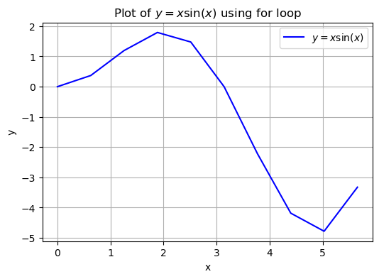
    


```python
plt.figure(figsize=(6, 4))
plt.plot(x_np, y_np, label='$y = x \\sin(x)$', color='red')
plt.title('Plot of $y = x \\sin(x)$ using numpy')
plt.xlabel('x')
plt.ylabel('y')
plt.legend()
plt.grid(True)
plt.show()
```


    
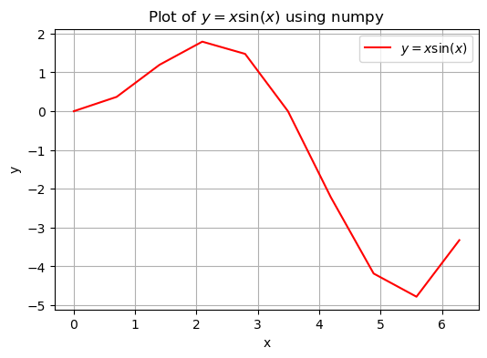
    


#### Ploting styles

**Markers**

|character|description|
|---|---|
|`'.'`|point marker|
|`','`|pixel marker|
|`'o'`|circle marker|
|`'v'`|triangle_down marker|
|`'^'`|triangle_up marker|
|`'<'`|triangle_left marker|
|`'>'`|triangle_right marker|
|`'1'`|tri_down marker|
|`'2'`|tri_up marker|
|`'3'`|tri_left marker|
|`'4'`|tri_right marker|
|`'8'`|octagon marker|
|`'s'`|square marker|
|`'p'`|pentagon marker|
|`'P'`|plus (filled) marker|
|`'*'`|star marker|
|`'h'`|hexagon1 marker|
|`'H'`|hexagon2 marker|
|`'+'`|plus marker|
|`'x'`|x marker|
|`'X'`|x (filled) marker|
|`'D'`|diamond marker|
|`'d'`|thin_diamond marker|
|`'\|'`|vline marker|
|`'_'`|hline marker|

**Line Styles**

|character|description|
|---|---|
|`'-'`|solid line style|
|`'--'`|dashed line style|
|`'-.'`|dash-dot line style|
|`':'`|dotted line style|

Example format strings:

'b'    # blue markers with default shape
'or'   # red circles
'-g'   # green solid line
'--'   # dashed line with default color
'^k:'  # black triangle_up markers connected by a dotted line

**Colors**

The supported color abbreviations are the single letter codes

|character|color|
|---|---|
|`'b'`|blue|
|`'g'`|green|
|`'r'`|red|
|`'c'`|cyan|
|`'m'`|magenta|
|`'y'`|yellow|
|`'k'`|black|
|`'w'`|white|

and the `'CN'` colors that index into the default property cycle.

If the color is the only part of the format string, you can additionally use any [`matplotlib.colors`](https://matplotlib.org/stable/api/colors_api.html#module-matplotlib.colors "matplotlib.colors") spec, e.g. full names (`'green'`) or hex strings (`'#008000'`).


```python
y = np.array([1,2,3,4])

plt.plot(y, "--mp", label="graph1")
plt.plot(y**2, "-", label = "graph2")
plt.legend()
```


    <matplotlib.legend.Legend at 0x15cac9df4d0>


    
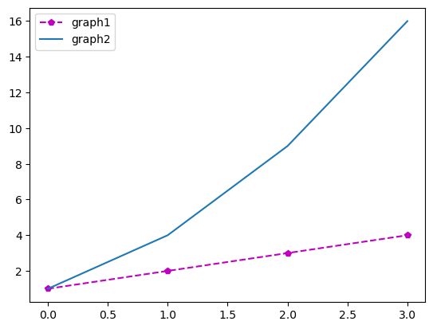
    


### Integrating using scipy


```python
import numpy as np
from scipy.integrate import quad

def integrand(x):
    return np.sin(x)

integral = quad(integrand,0, np.pi)
print(integral)
```

    (2.0, 2.220446049250313e-14)
    

### Riemanns Sum

The **Riemann sum** is a method of approximating the total area under a curve, often used as an introduction to the concept of definite integrals in calculus. It breaks the interval of integration into smaller subintervals and calculates the sum of the areas of rectangles or trapezoids that approximate the region under the curve.

#### Basic Idea

Given a function $f(x)$ defined on an interval $[a, b]$, the area under the curve is approximated by dividing the interval into $n$ subintervals of equal or unequal widths.

- Let $[x_0, x_1, x_2, \dots, x_n]$ divide $[a, b]$ into $n$ subintervals.
- For each subinterval $[x_{i-1}, x_i]$, a rectangle is constructed with height determined by $f(x)$ evaluated at some point $x_i^*$ in that interval.

The Riemann sum is given by:
$$
S = \sum_{i=1}^n f(x_i^*) \Delta x_i,
$$
where:
- $\Delta x_i = x_i - x_{i-1}$ is the width of the $i$-th subinterval.
- $x_i^*$ is the sample point in the interval $[x_{i-1}, x_i]$ (e.g., left endpoint, right endpoint, or midpoint).

---

#### Types of Riemann Sums

##### 1. Left Riemann Sum

The sample point $x_i^*$ is the **left endpoint** of each subinterval:
$$
S_{\text{left}} = \sum_{i=1}^n f(x_{i-1}) \Delta x_i.
$$

---

##### 2. Right Riemann Sum

The sample point $x_i^*$ is the **right endpoint** of each subinterval:
$$
S_{\text{right}} = \sum_{i=1}^n f(x_i) \Delta x_i.
$$

---

##### 3. Midpoint Riemann Sum

The sample point $x_i^*$ is the **midpoint** of each subinterval:
$$
S_{\text{mid}} = \sum_{i=1}^n f\left(\frac{x_{i-1} + x_i}{2}\right) \Delta x_i.
$$

---


```python
import numpy as np
from scipy.integrate import quad

def integrand(x):
    return np.sin(x)

a = 0
b = np.pi
n = 11
delta = (b - a) / (n - 1)
x = np.linspace(a, b, n)
y = integrand(x)


actualValue, _ = quad(integrand,a,b)

riemannLeft = delta * sum(y[:n-1])
errRiemannLeft = actualValue - riemannLeft

riemannRight = delta * sum(y[1:])
errRiemannRight = actualValue - riemannRight

print(f"Actual Value: {actualValue}")

print(f"Riemann Left: {riemannLeft}")
print(f"Error Riemann Left: {errRiemannLeft}")

print(f"Riemann Right: {riemannRight}")
print(f"Error Riemann Right: {errRiemannRight}")

```

    Actual Value: 2.0
    Riemann Left: 1.9835235375094546
    Error Riemann Left: 0.01647646249054535
    Riemann Right: 1.9835235375094546
    Error Riemann Right: 0.01647646249054535
    


```python
import numpy as np
import matplotlib.pyplot as plt

# Setup for the problem
a = 0
b = np.pi
n = 11  # Number of subintervals
h = (b - a) / (n - 1)
x = np.linspace(a, b, n)
f = np.sin(x)

# Left Riemann sum
x_left = x[:n-1]  # Left endpoints
y_left = f[:n-1]  # Heights at left endpoints

# Right Riemann sum
x_right = x[1:]  # Right endpoints
y_right = f[1:]  # Heights at right endpoints

# Fine x values for plotting sin(x)
x_fine = np.linspace(a, b, 1000)
y_fine = np.sin(x_fine)

# Create subplots
fig, axs = plt.subplots(1,2, figsize = (10,6))

# 1. Left Riemann Sum Plot
axs[0].plot(x_fine, y_fine, label='sin(x)', color='black')
axs[0].bar(x_left, y_left, width=h, align='edge', alpha=0.4, color='red', edgecolor='black')
axs[0].set_title('Left Riemann Sum Approximation')
axs[0].set_xlabel('x')
axs[0].set_ylabel('sin(x)')

# 2. Right Riemann Sum Plot
axs[1].plot(x_fine, y_fine, label='sin(x)', color='black')
axs[1].bar(x_right, y_right, width=-h, align='edge', alpha=0.4, color='blue', edgecolor='black')
axs[1].set_title('Right Riemann Sum Approximation')
axs[1].set_xlabel('x')
axs[1].set_ylabel('sin(x)')

# Adjust layout
plt.tight_layout()

# Show the plot
plt.show()

```


    
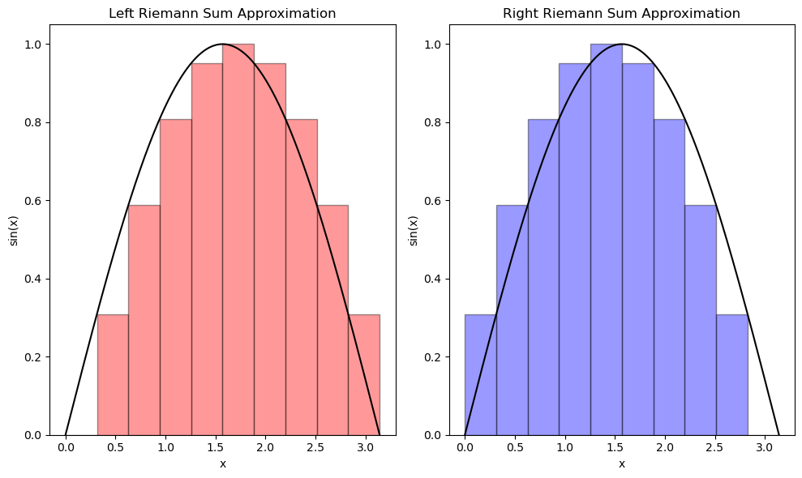
    


## Lab 2: Taylor Series

### Taylor Series

#### Taylor series generated by f at x = a

$$f(x) = \sum_{k=0}^{\infty} \frac{f^{(k)}(a)}{k!} (x - a)^k$$

$$f(x) = f(a) + f'(a) \cdot (x - a) + \frac{f''(a)}{2!} \cdot (x - a)^2 + \cdots + \frac{f^{(n)}(a)}{n!} \cdot (x - a)^n + \cdots$$

#### The **Maclaurin series** of ƒ is the Taylor series generated by ƒ at x = 0, 

$$f(x) = \sum_{k=0}^{\infty} \frac{f^{(k)}(0)}{k!} x^k$$

$$f(x) = f(0) + f'(0) \cdot x + \frac{f''(0)}{2!} \cdot x^2 + \cdots + \frac{f^{(n)}(0)}{n!} \cdot x^n + \cdots$$

### Calculating derivatives using Sympy


```python
from sympy import symbols, diff

x = symbols('x')

f_x = x**6

n = 3
a = 1

# Computer n-th order derivative
f_n = diff(f_x,x,n)

# Evaluate derivative at x = a
f_n_at_a = f_n.subs(x, a)

print(f_n_at_a)
```

    120
    

### Example

Find the Taylor series for $f(x) = \frac{1}{x+1}$ around $a = 3$ up to the 5th order.


```python
import numpy as np
import matplotlib.pyplot as plt
from sympy import symbols, diff, lambdify, factorial, sin

x = symbols('x')

# Function f(x) = 1 / (x + 1)
f_x = 1 / (x + 1)

# # Function f(x) = sin(x)
# f_x = sin(x)


# Taylor series expansion point a = 3
a = 3

# Define the Taylor series expansion up to n terms
def taylor_series(f, a, n_terms):
    
    taylor_expansion = 0
    for n in range(n_terms):
        # Compute n-th derivative of f
        f_n = diff(f, x, n)
        # Evaluate derivative at x = a
        f_n_at_a = f_n.subs(x, a)
        # Add the n-th term to the series
        taylor_expansion += (f_n_at_a / factorial(n)) * (x - a)**n
    return taylor_expansion

# Number of terms for the Taylor series
n_terms = 5

# Get the Taylor series expansion of f(x) around a = 3
taylor_expansion = taylor_series(f_x, a, n_terms)

# Print the Taylor series expansion
print(f"Taylor series expansion of f(x) = 1 / (x + 1) around x = 3 (up to {n_terms} terms):")
# print(f"Taylor series expansion of f(x) = sin (x) around x = 3 (up to {n_terms} terms):")
print(taylor_expansion)

# Convert to a numerical function for plotting
taylor_expansion_num = lambdify(x, taylor_expansion, "numpy")
f_x_num = lambdify(x, f_x, "numpy")

# Plotting the original function and its Taylor series approximation
x_vals = np.linspace(1, 5, 400)
f_vals = f_x_num(x_vals)
taylor_vals = taylor_expansion_num(x_vals)

plt.figure(figsize=(10, 6))
plt.plot(x_vals, f_vals, label="f(x) = 1 / (x + 1)", color='blue')
plt.plot(x_vals, taylor_vals, label=f"Taylor series (n = {n_terms})", linestyle='--', color='red')
plt.axvline(x=a, color='green', linestyle=':', label=f"Expansion point x = {a}")
plt.title("Taylor Series Approximation of f(x) = 1 / (x + 1) around x = 3")
plt.xlabel("x")
plt.ylabel("f(x)")
plt.legend()
plt.grid(True)
plt.show()

```

    Taylor series expansion of f(x) = 1 / (x + 1) around x = 3 (up to 5 terms):
    -x/16 + (x - 3)**4/1024 - (x - 3)**3/256 + (x - 3)**2/64 + 7/16
    


    
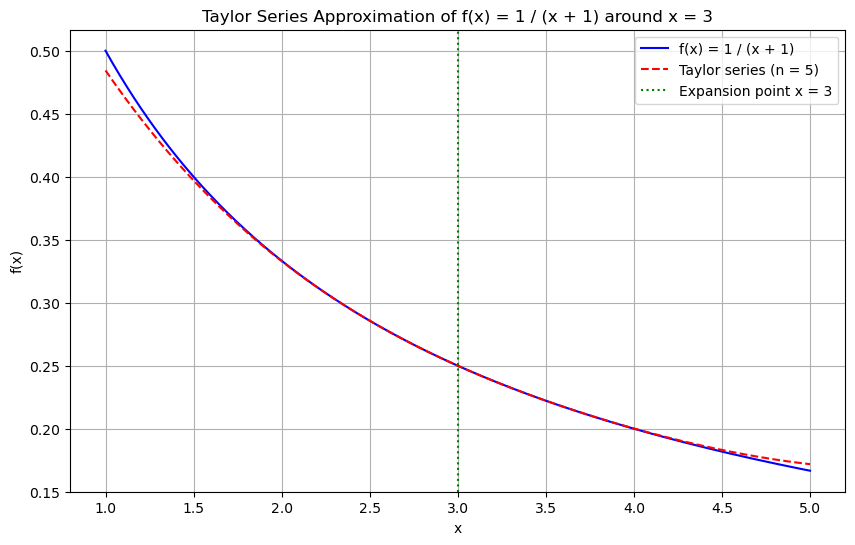
    


#### Step 1: Write the Taylor Series Formula at $x = 0$ for $f(x) = \sin(x)$

The Maclaurin series is a special case of the Taylor series where $a = 0$. The formula for the Maclaurin series is:

$$
f(x) = \sum_{k=0}^{\infty} \frac{f^{(k)}(0)}{k!} x^k
$$

Here, we need to compute the derivatives of $f(x) = \sin(x)$ at $x = 0$.

#### Step 2: Compute the First Few Derivatives of $ \sin(x) $

1. **First derivative**:
   $$
   f(x) = \sin(x), \quad f(0) = \sin(0) = 0
   $$
2. **Second derivative**:
   $$
   f'(x) = \cos(x), \quad f'(0) = \cos(0) = 1
   $$
3. **Third derivative**:
   $$
   f''(x) = -\sin(x), \quad f''(0) = -\sin(0) = 0
   $$
4. **Fourth derivative**:
   $$
   f^{(3)}(x) = -\cos(x), \quad f^{(3)}(0) = -\cos(0) = -1
   $$
5. **Fifth derivative**:
   $$
   f^{(4)}(x) = \sin(x), \quad f^{(4)}(0) = \sin(0) = 0
   $$

We observe that the derivatives of $\sin(x)$ repeat every four terms: $\sin(x), \cos(x), -\sin(x), -\cos(x)$.

#### Step 3: Write the First Few Non-Zero Terms of the Series

Now we will use the derivatives at $x = 0$ to write the series expansion.

1. **First term** (k = 0):
   $$
   \frac{f(0)}{0!} x^0 = 0
   $$
2. **Second term** (k = 1):
   $$
   \frac{f'(0)}{1!} x^1 = \frac{1}{1!} x = x
   $$
3. **Third term** (k = 2):
   $$
   \frac{f''(0)}{2!} x^2 = 0
   $$
4. **Fourth term** (k = 3):
   $$
   \frac{f^{(3)}(0)}{3!} x^3 = \frac{-1}{3!} x^3 = -\frac{x^3}{6}
   $$
5. **Fifth term** (k = 4):
   $$
   \frac{f^{(4)}(0)}{4!} x^4 = 0
   $$
6. **Sixth term** (k = 5):
   $$
   \frac{f^{(5)}(0)}{5!} x^5 = \frac{1}{5!} x^5 = \frac{x^5}{120}
   $$

#### Step 4: Combine the Non-Zero Terms

The Maclaurin series up to the 5th order for $\sin(x)$ is:

$$
\sin(x) = x - \frac{x^3}{3!} + \frac{x^5}{5!} + \cdots
$$

Substituting the factorial values:

$$
\sin(x) = x - \frac{x^3}{6} + \frac{x^5}{120} + \cdots
$$

#### Step 5: Generalize the Series

Looking at the pattern, the general term for the Maclaurin series of $\sin(x)$ is:

$$
\sin(x) = \sum_{k=0}^{\infty} (-1)^k \frac{x^{2k+1}}{(2k+1)!}
$$


Order : 1 3 5 7
 
k &nbsp;&nbsp;&nbsp;&nbsp;&nbsp;&nbsp;&nbsp;&nbsp;: 0 1 2 3


$$k = (order - 1)/2$$

#### Reviewing For Loop


```python
for i in range(0):
    print(i)
```


```python
for k in range(6):
    print(k)
```

    0
    1
    2
    3
    4
    5
    


```python
import numpy as np
import matplotlib.pyplot as plt
import math

def compute_taylor_series(x, order):
    """Compute the Taylor series approximation of sin(x) around 0."""
    
    y_approx = np.zeros_like(x)

    # if k = math.floor((((order - 1)/ 2)+1))
    #      = (order + 1) // 2
    # Floor Division: '//' performs division and then rounds down to the nearest integer.

    for k in range((order + 1) // 2):
        term = ((-1)**k * x**(2*k + 1)) / math.factorial(2*k + 1)
        y_approx += term
    return y_approx


# Define the x values and the true value of sin(1.5)
x = np.linspace(-np.pi, np.pi, 200)
test_val = 1.5
true_value = np.sin(test_val)

# Initialize dictionaries to store Taylor series approximations and errors
test_val_approximations = {}
test_val_errors = {}

# Define orders for the Taylor series approximations
orders = [1, 3, 5, 7]

# Compute and store Taylor series approximations and errors
plt.figure(figsize=(10, 8))
for order in orders:
    y = compute_taylor_series(x, order)

    # Plot the Taylor series approximation
    plt.plot(x, y, label=f'{order} Order')

    # Calculate the Taylor series approximation value at x_val
    taylor_value = compute_taylor_series(test_val,order)
    error = abs(true_value - taylor_value)
    test_val_approximations[order] = taylor_value
    test_val_errors[order] = error


# Plot the actual sine function
plt.plot(x, np.sin(x), 'k', label='Analytic')
plt.grid()
plt.title('Taylor Series Approximations of Various Orders')
plt.xlabel('x')
plt.ylabel('y')
plt.legend()
plt.show()

# Print the true value and calculated values
print(f'True value of sin(1.5): {true_value:.6f}')
for order in orders:
    print(f'Value for {order} Order Taylor series approximation at x = {test_val}: {test_val_approximations[order]:.6f}')
    print(f'Error for {order} Order Taylor series approximation at x = {test_val}: {test_val_errors[order]:.6f}')

```


    
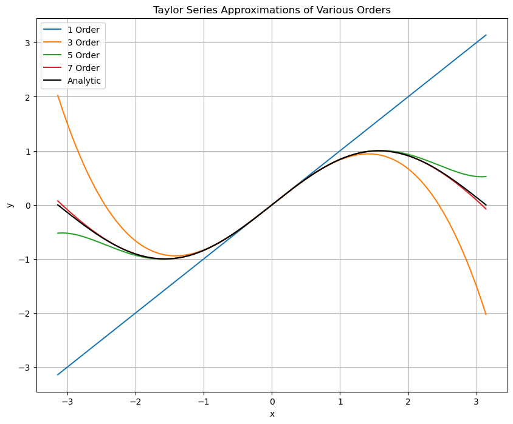
    


    True value of sin(1.5): 0.997495
    Value for 1 Order Taylor series approximation at x = 1.5: 1.500000
    Error for 1 Order Taylor series approximation at x = 1.5: 0.502505
    Value for 3 Order Taylor series approximation at x = 1.5: 0.937500
    Error for 3 Order Taylor series approximation at x = 1.5: 0.059995
    Value for 5 Order Taylor series approximation at x = 1.5: 1.000781
    Error for 5 Order Taylor series approximation at x = 1.5: 0.003286
    Value for 7 Order Taylor series approximation at x = 1.5: 0.997391
    Error for 7 Order Taylor series approximation at x = 1.5: 0.000104
    

### Bisection Method

1. **Initial Interval**:  
   Select an interval $[a, b]$ where the function $f(x)$ changes sign, i.e., $f(a) \times f(b) < 0$.

2. **Midpoint Calculation**:  
   Find the midpoint $c = \frac{a + b}{2}$ of the interval.

3. **Interval Halving**:  
   Check the sign of $f(c)$:
   - If $f(c)$ has the same sign as $f(a)$, replace $a$ with $c$.
   - Otherwise, replace $b$ with $c$.

4. **Convergence Check**:  
   Repeat the process until:
   - The interval is sufficiently small.
   - Or until $f(c)$ is close enough to zero.


```python
def f(x):
    return x**2 - 4

a, b = 1, 3
tolerance = 0.001

while b - a > tolerance:
    c = (a + b) / 2
    if f(c) == 0:  # Check if c is exactly a root
        break
    elif f(a) * f(c) < 0:  # Root is in [a, c]
        b = c
    else:  # Root is in [c, b]
        a = c
    

print("Root:", c)
```

    Root: 2.0
    

## Lab 3: Solutions of Equations in One Variable

### Fixed Point Iteration

Fixed point iteration is a numerical method used to find solutions to equations of the form $ x = g(x) $, where $g$ is a function.

#### Steps

1. **Choose a Function**: Define $g(x)$ such that $x = g(x)$ has a fixed point.
2. **Initial Guess**: Select an initial guess $x_0$.
3. **Iterate**: Compute subsequent values using:
   $x_{n+1} = g(x_n)$
   Continue until $|x_{n+1} - x_n| < \epsilon$.
4. **Convergence Check**: Ensure the function meets conditions for convergence, typically that $|g'(x)| < 1$ near the fixed point.


### Example

$f(x) = 2x^3 - 2x -5$

$x = g(x) = \sqrt[3]{(\frac{2x +5}{2})}$


```python
import matplotlib.pyplot as plt
import numpy as np

# f(x) = 2*x**3 - 2*x - 5 = 0
f = lambda x: 2*x**3 - 2*x -5

g = lambda x: ((2*x + 5) / 2)**(.1 / .3)

p_arr = []

TOL = 0.0001
# max iterations
N = 100
i = 1
# guess p0
p0 = 0
# initializing p with zero
p = 0
while i <= N:
    p = g(p0)
    p_arr.append(p)
    if abs(p-p0) < TOL:
        print(f"Root: {p} with {i} iterations.")
        print(p)
        break;
    i = i + 1
    p0 = p

else:
    print(f"The method failed after {N} iterations")


x_graph = np.linspace(-1,2,400)
g_graph = g(x_graph)
f_graph = f(x_graph)

plt.figure(figsize=(10,4))
plt.title("Fixed Point Iterations")
plt.subplot(1,2,1)
plt.xlabel('x')
plt.ylabel('y')
plt.axhline(0, color='black', lw=0.5, ls='--')
plt.axvline(0, color='black', lw=0.5, ls='--')
plt.grid()
plt.plot(x_graph, f_graph, label="f(x) =  $2x^3 - 2x -5$")
np_p = np.array(p_arr)
plt.scatter(np_p, f(np_p), label="P", color="red")
plt.legend()

plt.subplot(1,2,2)
plt.xlabel('x')
plt.ylabel('y')
plt.axhline(0, color='black', lw=0.5, ls='--')
plt.axvline(0, color='black', lw=0.5, ls='--')
plt.grid()
plt.plot(x_graph, g_graph, label="g(x) = $\\sqrt[3]{\\frac{2x+5}{2}}$")
plt.scatter(np_p, g(np_p),label="p", color="red")
plt.legend()
plt.show()


```

    Root: 1.6005892555955437 with 6 iterations.
    1.6005892555955437
    


    
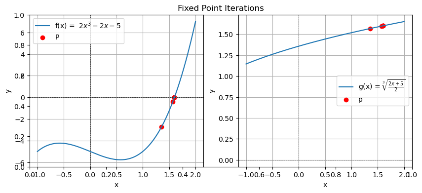
    


### Newton's Method
Newton's method (or the Newton-Raphson method) is a numerical technique used to find approximate solutions to equations of the form $ f(x) = 0 $.

#### Steps

1. **Choose a Function**: Define the function $ f(x) $ whose root you want to find.
2. **Initial Guess**: Select an initial guess $ x_0 $.
3. **Iterate**: Compute subsequent approximations using the formula:
   $$
   x_{n+1} = x_n - \frac{f(x_n)}{f'(x_n)}
   $$
   Continue iterating until the change is sufficiently small, typically $ |x_{n+1} - x_n| < \epsilon $.
4. **Convergence Check**: Verify that the function $ f $ and its derivative $ f' $ are continuous and that $ f'(x_n) \neq 0 $ at the iterations.

### Example
To solve $ x^2 - 2 = 0 $:
1. Define $ f(x) = x^2 - 2 $ and $ f'(x) = 2x $.
2. Start with $ x_0 = 1 $.
3. Iterate:
   - $ x_1 = 1 - \frac{f(1)}{f'(1)} = 1 - \frac{-1}{2} = 1.5 $
   - $ x_2 = 1.5 - \frac{f(1.5)}{f'(1.5)} \approx 1.4167 $
   - Continue until values stabilize.


```python
import numpy as np
import matplotlib.pyplot as plt

# Define the function and its derivative
f = lambda x: x**2 - 2
df = lambda x: 2 * x

# Initial guess
x0 = 1.0
TOL = 1e-7
N = 100

# List to store x values for plotting
x_values = [x0]

# Iteration
for n in range(N):
    f_x0 = f(x0)
    df_x0 = df(x0)

    if df_x0 == 0:
        print("Derivative is zero. No solution found.")
        break

    # Update the approximation
    x1 = x0 - f_x0 / df_x0

    # Store the x value
    x_values.append(x1)

    # Check for convergence
    if abs(x1 - x0) < TOL:
        print(f"Root found: {x1}")
        break

    x0 = x1
else:
    print("Maximum iterations reached. No solution found.")

# Plotting
x_range = np.linspace(-2, 2, 400)
y_range = f(x_range)

plt.figure(figsize=(10, 6))
plt.plot(x_range, y_range, label='f(x) = x^2 - 2', color='blue')
plt.axhline(0, color='black', lw=0.5, ls='--')
plt.axvline(0, color='black', lw=0.5, ls='--')

# Mark the iterations
x_np = np.array(x_values)
plt.plot(x_np, f(x_np), 'rx', label="x")

plt.title("Newton's Method for Finding Roots")
plt.xlabel('x')
plt.ylabel('f(x)')
plt.legend()
plt.grid()
plt.ylim(-3, 3)
plt.show()

```

    Root found: 1.4142135623730951
    


    
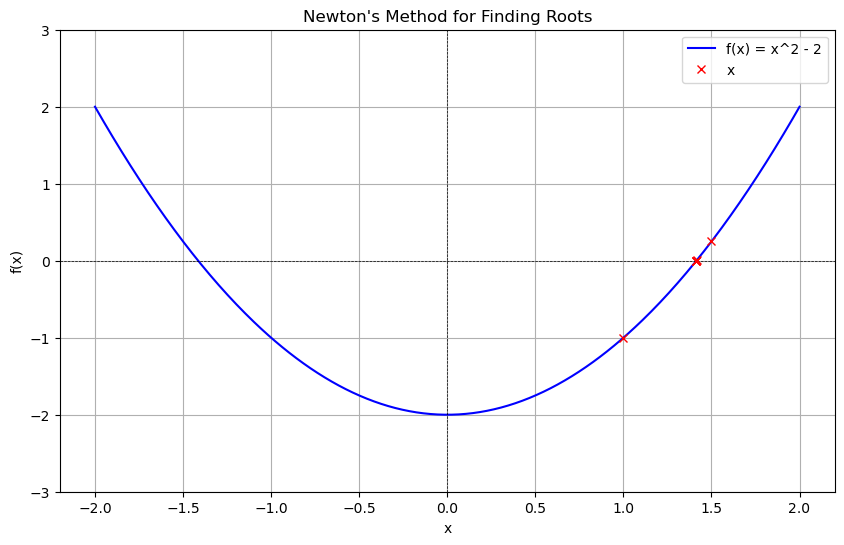
    


## Lab 4: Interpolation and Polynomial Approximation
---

### Secant Method

#### Objective
To implement the Secant Method in Python and use it to approximate the root of a nonlinear equation $f(x) = 0$.

---

#### Introduction

The Secant Method is a numerical technique used to find roots of a function. It is an iterative method that requires two initial guesses and uses linear interpolation to approximate the root. Unlike Newton's Method, the Secant Method does not require the computation of derivatives, making it suitable for functions that are difficult to differentiate.

#### Algorithm Steps
1. Start with two initial guesses $x_0$ and $x_1$.
2. Compute the next approximation $x_{n+1}$ using the formula:
   $$
   x_{n+1} = x_n - \frac{f(x_n)(x_n - x_{n-1})}{f(x_n) - f(x_{n-1})}
   $$
3. Check if $|f(x_{n+1})|$ or $|x_{n+1} - x_n|$ is less than the desired tolerance ($\text{tol}$). If true, stop the iteration.
4. Update $x_0$ and $x_1$ to $x_1$ and $x_{n+1}$, respectively, and repeat until convergence or the maximum number of iterations is reached.
5. If the method fails to converge, report the failure.


```python
def secant_method(f, x0, x1, tol=1e-6, max_iter=100):
    """
    Solve f(x) = 0 using the Secant Method.

    Parameters:
    f : function
        The function for which we want to find the root.
    x0 : float
        The first initial guess.
    x1 : float
        The second initial guess.
    tol : float, optional
        The tolerance for convergence (default is 1e-6).
    max_iter : int, optional
        The maximum number of iterations (default is 100).

    Returns:
    float
        The approximated root or None if the method fails.
    """
    for i in range(max_iter):
        if abs(f(x1)) < tol:
            print(f"Converged to {x1} after {i} iterations.")
            return x1

        # Compute the next approximation
        try:
            x2 = x1 - f(x1) * (x1 - x0) / (f(x1) - f(x0))
        except ZeroDivisionError:
            print("Division by zero encountered in the iteration process.")
            return None

        # Update the guesses
        x0, x1 = x1, x2

    print("Failed to converge within the maximum number of iterations.")
    return None

# Define the function
f = lambda x: x**2 - 2  # Finding the square root of 2
root = secant_method(f, 1, 2)
print(f"Root: {root}")
```

    Converged to 1.4142135620573204 after 5 iterations.
    Root: 1.4142135620573204
    

### Lagrange Interpolation

Lagrange Interpolation is a numerical method used to estimate a function $ f(x) $ that passes through a given set of data points. This method constructs a polynomial of degree $ n-1 $ (where $ n $ is the number of points) that exactly passes through these points.

---

Given $ n $ data points:  
$$
(x_0, y_0), (x_1, y_1), \ldots, (x_{n-1}, y_{n-1}),
$$  
the Lagrange interpolating polynomial is defined as:
$$
P(x) = \sum_{i=0}^{n-1} y_i L_i(x),
$$
where $( L_i(x) )$ are the Lagrange basis polynomials, given by:
$$
L_i(x) = \prod_{\substack{j=0 \\ j \neq i}}^{n-1} \frac{x - x_j}{x_i - x_j}.
$$

Each basis polynomial $ (L_i(x)) $ is constructed so that:
- $ L_i(x_i) = 1 $ for the $i$-th data point.
- $ L_i(x_j) = 0 $ for all $ j \neq i $.

Thus, the interpolating polynomial $ P(x) $ is a weighted sum of the $ y_i $ values, with weights determined by $ L_i(x) $.

---


```python
# Importing necessary libraries
import numpy as np
import matplotlib.pyplot as plt

# Lagrange interpolation function
def lagrange(n, x, y, xp):
    yp = 0  # Initialize interpolated value to zero
    
    # Implementing Lagrange Interpolation
    for i in range(n):
        p = 1
        for j in range(n):
            if i != j:
                p *= (xp - x[j]) / (x[i] - x[j])
        yp += p * y[i]
    
    return yp

# Given data points
x = np.array([0, 2, 4, 6, 8])
y = np.array([0, 5, 4, 2, 3])

# Points where interpolation is to be evaluated
x_np = np.linspace(0, 8, 400)
y_np = np.zeros_like(x_np)

# Apply Lagrange interpolation for each point in x_np
for i in range(x_np.size):
    y_np[i] = lagrange(x.size, x, y, x_np[i])

# Plot the interpolated curve
plt.plot(x_np, y_np, label='Interpolated Curve')
plt.scatter(x, y, color='red', label='Data Points')
plt.legend()
plt.title("Lagrange Interpolation")
plt.xlabel("x")
plt.ylabel("y")
plt.grid(True)
plt.show()

```


    
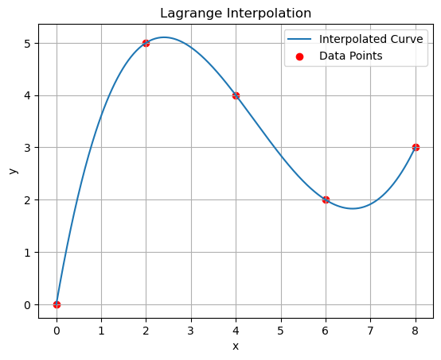
    


## Lab 5: Interpolation and Polynomial Approximation - II

### Divided Differences

|     |                       |                   |                   |                   | 
|-----|-----------------------|-------------------|-------------------|-------------------| 
|  y0 |         f[x1,x0]      |   f[x2,x1,x0]     |  f[x3,x2,x1,x0]   | f[x4,x3,x2,x1,x0] | 
|  y1 |         f[x2,x1]      |   f[x3,x2,x1]     |  f[x4,x3,x2,x1]   |         0         | 
|  y2 |         f[x3,x2]      |   f[x4,x3,x2]     |         0         |         0         | 
|  y3 |         f[x4,x3]      |         0         |         0         |         0         |
|  y4 |             0         |         0         |         0         |         0         |


```python
import numpy as np
import matplotlib.pyplot as plt
```


```python
def divided_diff(x, y):
    '''
    function to calculate divided differences table
    '''
    n = len(y)
    coef = np.zeros([n,n])
    coef[:,0] = y

    for j in range (1,n):
        for i in range(n-j):
            coef[i][j] = (coef[i+1][j-1] - coef[i][j-1]) / (x[i+j] -  x[i])
    
    return coef
```

$$f(x) = a_0 + a_1(x - x_0) + a_2(x - x_0)(x - x_1) + \cdots + a_n(x - x_0)(x - x_1) \cdots (x - x_{n-1})$$

which can be re-written as

$$f(x) = \sum_{i=0}^{n} a_i n_i(x)$$

where 

$$n_i(x) = \prod_{j=0}^{i-1} (x - x_j)$$


```python
def newton_poly(coef, x_data, x):
    '''
    evaluate the newton polynomial 
    at x
    '''
    
    p = coef[0]
    for c in range(1, len(coef)):
        xi = 1
        for i in range(c):
            xi = xi * (x-x_data[i])
                
        p = p + coef[c]* xi
    
    return p


```


```python
x = np.array([-5, -1, 0, 2])
y = np.array([-2, 6, 1, 3])


# get the divided difference coef
a_s = divided_diff(x, y)[0, :]

# evaluate on new data points
x_new = np.arange(-5, 2.1, .1)
y_new = newton_poly(a_s, x, x_new)

plt.figure(figsize = (12, 8))
plt.plot(x, y, 'bo')
plt.plot(x_new, y_new)
plt.xlabel('X', fontsize=12)
plt.ylabel('Function', fontsize=12)
plt.title('Newton Interpolation Method')
plt.grid(color = 'gray', linestyle = '--', linewidth = 0.5)
plt.legend(['Data','Interpolation'], loc ="lower right")

```


    <matplotlib.legend.Legend at 0x1aa7b720a10>


    
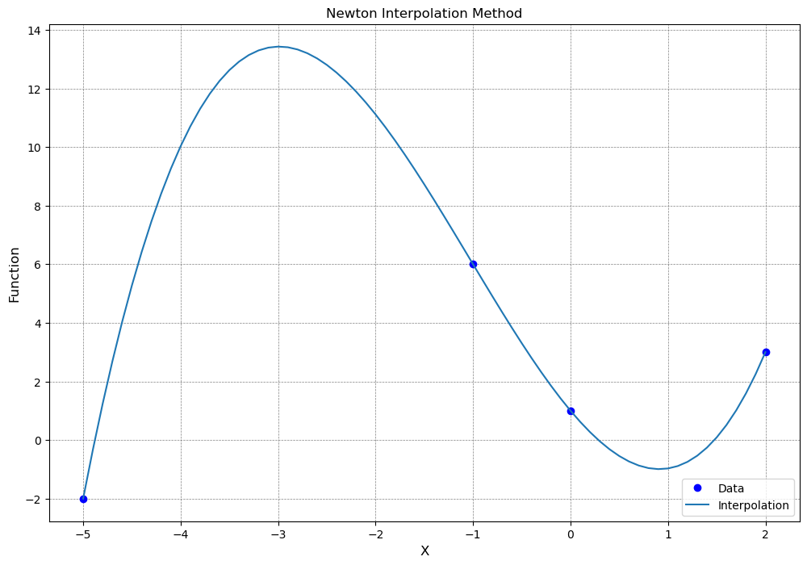
    


## Lab 6: Cubic Splines

### Cubic Spline
Cubic spline interpolation is a piecewise polynomial interpolation method that ensures smoothness and continuity. It uses cubic polynomials in each interval $[x_i, x_{i+1}]$, ensuring that the spline and its first and second derivatives are continuous.

#### Key Steps in Computing Cubic Splines

1. **Cubic Polynomial Form**:
   Each interval $[x_i, x_{i+1}]$ is represented by:
   $$
   S_i(x) = a_i + b_i(x - x_i) + c_i(x - x_i)^2 + d_i(x - x_i)^3
   $$

2. **Conditions**:
   - Interpolation: The spline passes through the given points ($S_i(x_i) = y_i$ and $S_i(x_{i+1}) = y_{i+1}$).
   - Continuity: The first and second derivatives are continuous at internal points.
   - Boundary conditions: Natural spline assumes the second derivatives at the endpoints are zero.

3. **Matrix Formulation**:
   Using the above conditions, a tridiagonal matrix system is solved to determine the coefficients.


```python
import numpy as np
import matplotlib.pyplot as plt

def cubic_spline(x, y, num_points=100):
    # Number of data points
    n = len(x)
    
    # Step 1: Calculate the spline coefficients
    h = np.diff(x)
    alpha = (3 / h[1:]) * (y[2:] - y[1:-1]) - (3 / h[:-1]) * (y[1:-1] - y[:-2])

    # Solve the system of linear equations for the second derivatives (spline coefficients)
    A = np.zeros((n, n))
    b = np.zeros(n)
    
    A[0, 0] = 1
    A[-1, -1] = 1
    for i in range(1, n - 1):
        A[i, i - 1] = h[i - 1]
        A[i, i] = 2 * (h[i - 1] + h[i])
        A[i, i + 1] = h[i]
        b[i] = alpha[i - 1]
    
    M = np.linalg.solve(A, b)

    # Step 2: Calculate the spline coefficients
    spline_coeffs = []
    for i in range(n - 1):
        a = (M[i+1] - M[i]) / (3 * h[i])
        b = (y[i+1] - y[i]) / h[i] - h[i] * (2 * M[i] + M[i+1]) / 3
        c = M[i]
        d = y[i]
        spline_coeffs.append((a, b, c, d))

    # Step 3: Interpolate and evaluate the spline
    x_new = np.linspace(x[0], x[-1], num_points)
    y_new = np.zeros_like(x_new)

    for j, xi in enumerate(x_new):
        for i in range(n - 1):
            if x[i] <= xi < x[i + 1]:
                a, b, c, d = spline_coeffs[i]
                dx = xi - x[i]
                y_new[j] = a * dx**3 + b * dx**2 + c * dx + d
                break

    return x_new, y_new

# Example usage
x = np.array([0, 1, 2, 3, 4])
y = np.array([0, 1, 0, 1, 0])

x_new, y_new = cubic_spline(x, y)

# Plot the result
plt.plot(x, y, 'o', label='Data Points')
plt.plot(x_new, y_new, label='Cubic Spline Interpolation')
plt.legend()
plt.show()

```


    
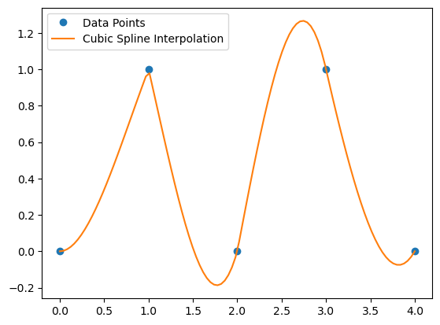
    


## Lab 7: Numerical Differentiation and Integration

### Numerical Differentiation Techniques

#### 1. Forward Difference (n+1 formula)

This method approximates the derivative using the function values at the point of interest and one point ahead.

$$
f'(x) \approx \frac{f(x+h) - f(x)}{h}
$$

Where:
- $f(x)$ is the function whose derivative we want to approximate.
- $h$ is a small step size.

#### 2. Three-Point Formula

This method uses three points to approximate the derivative. It is often a higher-order accurate method.

$$
f'(x) \approx \frac{f(x+h) - f(x-h)}{2h}
$$

Where:
- $f(x)$ is the function whose derivative we want to approximate.
- $h$ is a small step size.


```python
import numpy as np
import matplotlib.pyplot as plt

# Forward difference (n+1 formula)
def forward_difference(f, x, h):
    """
    Approximate the derivative of f at x using the forward difference formula.
    f: function to differentiate
    x: point at which to evaluate the derivative
    h: step size
    """
    return (f(x + h) - f(x)) / h

# Three-point central difference formula
def three_point_formula(f, x, h):
    """
    Approximate the derivative of f at x using the three-point formula.
    f: function to differentiate
    x: point at which to evaluate the derivative
    h: step size
    """
    return (f(x + h) - f(x - h)) / (2 * h)

# True derivative of f(x) = e^x * sin(x)
def true_derivative(x):
    return np.exp(x) * np.sin(x) + np.exp(x) * np.cos(x)

# Define a more complex function to differentiate: f(x) = e^x * sin(x)
def f(x):
    return np.exp(x) * np.sin(x)

# Range of x values for plotting
x_values = np.linspace(0.1, 5, 100)
h = 0.01  # Step size for numerical differentiation

# Compute the true derivatives
true_values = true_derivative(x_values)

# Compute the forward difference and three-point formula results
forward_values = forward_difference(f, x_values, h)
three_point_values = three_point_formula(f, x_values, h)

# Compute the errors
forward_error = np.abs(true_values - forward_values)
three_point_error = np.abs(true_values - three_point_values)

# Plot the numerical derivatives and the true derivative
plt.figure(figsize=(12, 6))

# Plot True Derivative
plt.plot(x_values, true_values, label="True Derivative (f'(x) = 2x)", color='black', linestyle='--')

# Plot Forward Difference (n+1 formula)
plt.plot(x_values, forward_values, label="Forward Difference (n+1)", color='blue')

# Plot Three-Point Formula
plt.plot(x_values, three_point_values, label="Three-Point Formula", color='red')

# Customize the plot
plt.title('Numerical Differentiation: Forward Difference vs Three-Point Formula')
plt.xlabel('x')
plt.ylabel('Derivative')
plt.legend()
plt.grid(True)
plt.show()

# Plot the errors
plt.figure(figsize=(12, 6))

# Plot Error for Forward Difference
plt.plot(x_values, forward_error, label="Error in Forward Difference", color='blue', linestyle='--')

# Plot Error for Three-Point Formula
plt.plot(x_values, three_point_error, label="Error in Three-Point Formula", color='red', linestyle='--')

# Customize the error plot
plt.title('Error in Numerical Differentiation Methods')
plt.xlabel('x')
plt.ylabel('Error')
plt.legend()
plt.grid(True)
plt.show()

```


    
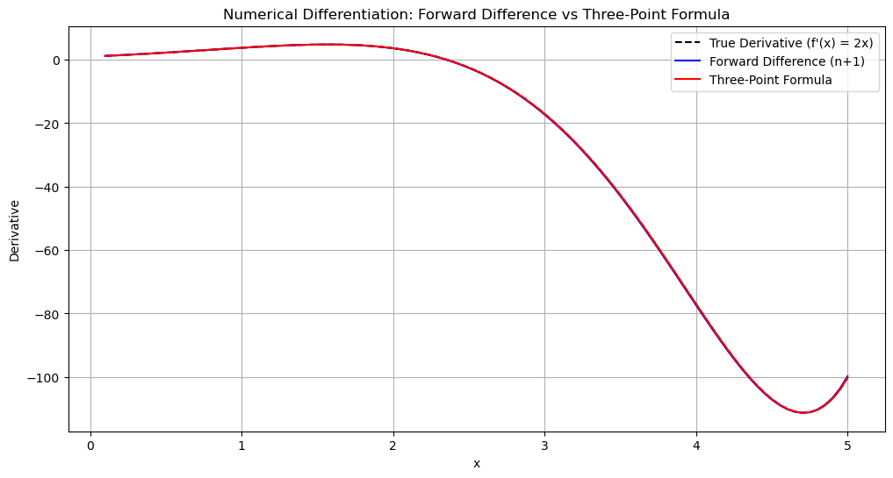
    


    
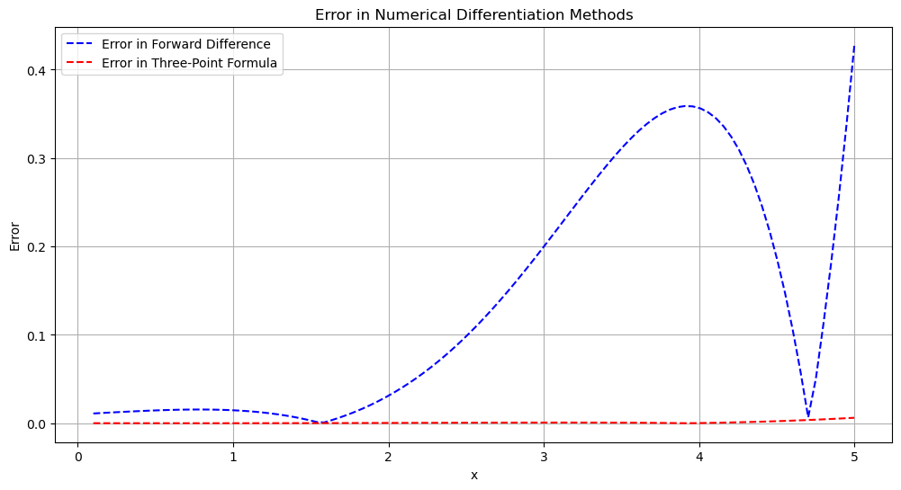
    


### Numerical Integration: Trapezoidal Rule

The **Trapezoidal Rule** is a numerical method for approximating the integral of a function. The rule approximates the area under a curve by dividing it into trapezoids, providing a more accurate approximation compared to the rectangle rule.

#### Trapezoidal Rule Formula

For a given interval $[a, b]$ and a function $f(x)$, the integral is approximated as:

$$
I \approx \int_a^b f(x) \, dx \approx \frac{h}{2} \left[ f(a) + 2 \sum_{i=1}^{n-1} f(x_i) + f(b) \right]
$$

Where:
- $h = \frac{b - a}{n}$ is the step size (the width of each subinterval).
- $n$ is the number of subintervals.
- $x_i$ are the points in the interval $[a, b]$, given by $x_i = a + i \cdot h$ for $i = 1, 2, ..., n-1$.


```python

```


```python
import numpy as np
import matplotlib.pyplot as plt

# Trapezoidal Rule Implementation
def trapezoidal_rule(f, a, b, n):
    """
    Approximate the integral of f(x) from a to b using the Trapezoidal Rule.
    f: function to integrate
    a: lower bound of integration
    b: upper bound of integration
    n: number of subintervals
    """
    # Step size
    h = (b - a) / n
    
    # Compute the sum using the trapezoidal rule
    integral = 0.5 * (f(a) + f(b))  # First and last terms
    for i in range(1, n):
        integral += f(a + i * h)  # Middle terms

    # Multiply by the step size
    integral *= h
    
    return integral

# Define a function to integrate, for example f(x) = x^2
def f(x):
    return x**2

# Set the bounds and the number of subintervals
a = 0  # Lower bound
b = 1  # Upper bound
n = 100  # Number of subintervals

# Compute the integral using the Trapezoidal Rule
result = trapezoidal_rule(f, a, b, n)
print(f"Approximate integral of f(x) = x^2 from {a} to {b} is: {result}")

# Compare with the exact integral
exact_integral = (b**3 - a**3) / 3  # Exact integral of x^2 from a to b
print(f"Exact integral is: {exact_integral}")


# Plot the function and the trapezoidal approximation
x_vals = np.linspace(a, b, 1000)
y_vals = f(x_vals)

# Plot the function
plt.plot(x_vals, y_vals, label="f(x) = x^2", color='blue')

# Plot the trapezoids
x_trap = np.linspace(a, b, n+1)
y_trap = f(x_trap)
for i in range(n):
    plt.fill_between(x_trap[i:i+2], y_trap[i:i+2], alpha=0.3, color='orange')

# Add labels and legend
plt.title('Trapezoidal Rule Approximation for f(x) = x^2')
plt.xlabel('x')
plt.ylabel('f(x)')
plt.legend()
plt.grid(True)
plt.show()

# Calculate error
error = abs(result - exact_integral)
print(f"Error in Trapezoidal Rule Approximation: {error}")

```

    Approximate integral of f(x) = x^2 from 0 to 1 is: 0.33335000000000004
    Exact integral is: 0.3333333333333333
    


    
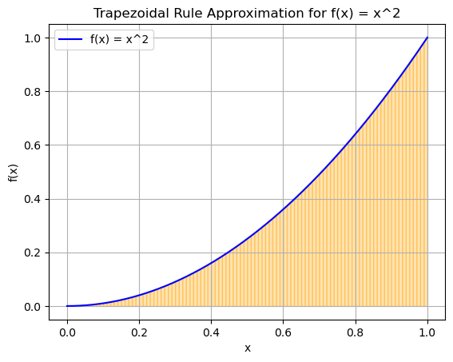
    


    Error in Trapezoidal Rule Approximation: 1.6666666666720342e-05
    

## Lab 8: Initial-Value Problems for Ordinary Differential Equations: Euler’s Method and Runge Kutta Method

### Euler's Method

Euler's Method is a simple numerical technique for solving ordinary differential equations of the form:

$$
\frac{dy}{dx} = f(x, y), \quad y(x_0) = y_0
$$

#### Algorithm

1. **Initialization**:
   - Define the initial conditions: $x_0, y_0$.
   - Choose the step size $h$.

2. **Iterative Steps**:
   For each iteration:
   - Compute the slope at the current point:
     $$
     f(x_n, y_n)
     $$
   - Update the solution:
     $$
     y_{n+1} = y_n + h \cdot f(x_n, y_n)
     $$
   - Advance to the next step:
     $$
     x_{n+1} = x_n + h
     $$

3. **Stopping Condition**:
   - Repeat the above steps until $x_n \geq x_{\text{end}}$.

#### Notes
- $h$ is the step size. Smaller $h$ improves accuracy but increases computational cost.
- The method assumes that $f(x, y)$ is continuous and differentiable.
- Euler's method is less accurate than higher-order methods like Runge-Kutta but easier to implement.


```python
import numpy as np

def euler_method(f, x0, y0, x_end, h):
    x_values = [x0]
    y_values = [y0]
    
    x = x0
    y = y0
    
    while x < x_end:
        y = y + h * f(x, y)
        x = x + h
        
        x_values.append(x)
        y_values.append(y)
    
    return np.array(x_values), np.array(y_values)
```

### Example 1

Given $\frac{dy}{dx} = x - y$, $y(0) = 1$, find $y(x)$ in the interval $[0, 2]$ with step size $h = 0.1$.

The exact solution to this equation is:

$$
y(x) = x - 1 + 2e^{-x}
$$


```python
import numpy as np
import matplotlib.pyplot as plt

def example_function(x, y):
    return x - y  # Example ODE: dy/dx = x - y

def exact_solution(x):
    return x - 1 + 2 * np.exp(-x)

x0 = 0
y0 = 1
x_end = 2
h = 0.1

x_vals, y_vals = euler_method(example_function, x0, y0, x_end, h)

exact_y_vals = exact_solution(x_vals)

# Print table header
print("x         Euler y        Exact y        Error")
print("-" * 45)

# Print values in tabular format
for x, y_euler, y_exact in zip(x_vals, y_vals, exact_y_vals):
    error = abs(y_exact - y_euler)
    print(f"{x:.2f}      {y_euler:.7f}      {y_exact:.7f}      {error:.7f}")

# Plot the solution
plt.plot(x_vals, y_vals, label="Euler's Method Solution",marker='o')
plt.plot(x_vals, exact_y_vals, label="Exact Solution", linestyle='--')
plt.xlabel("x")
plt.ylabel("y")
plt.legend()
plt.grid()
plt.show()
```

    x         Euler y        Exact y        Error
    ---------------------------------------------
    0.00      1.0000000      1.0000000      0.0000000
    0.10      0.9000000      0.9096748      0.0096748
    0.20      0.8200000      0.8374615      0.0174615
    0.30      0.7580000      0.7816364      0.0236364
    0.40      0.7122000      0.7406401      0.0284401
    0.50      0.6809800      0.7130613      0.0320813
    0.60      0.6628820      0.6976233      0.0347413
    0.70      0.6565938      0.6931706      0.0365768
    0.80      0.6609344      0.6986579      0.0377235
    0.90      0.6748410      0.7131393      0.0382983
    1.00      0.6973569      0.7357589      0.0384020
    1.10      0.7276212      0.7657422      0.0381210
    1.20      0.7648591      0.8023884      0.0375294
    1.30      0.8083732      0.8450636      0.0366904
    1.40      0.8575358      0.8931939      0.0356581
    1.50      0.9117823      0.9462603      0.0344781
    1.60      0.9706040      1.0037930      0.0331890
    1.70      1.0335436      1.0653670      0.0318234
    1.80      1.1001893      1.1305978      0.0304085
    1.90      1.1701703      1.1991372      0.0289669
    2.00      1.2431533      1.2706706      0.0275173
    


    
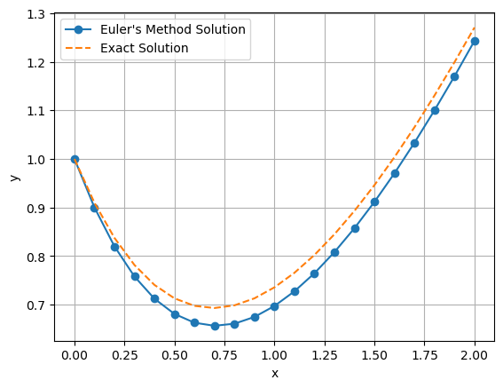
    


### Runge-Kutta 4th Order Method (RK4)

The Runge-Kutta 4th Order Method is a numerical technique for solving ordinary differential equations of the form:

$$
\frac{dy}{dx} = f(x, y), \quad y(x_0) = y_0
$$

#### Algorithm

1. **Initialization**:
   - Define the initial conditions: $x_0, y_0$.
   - Choose the step size $h$.

2. **Iterative Steps**:
   For each iteration:
   - Compute the intermediate slopes:
     - $k_1 = f(x_n, y_n)$
     - $k_2 = f\left(x_n + \frac{h}{2}, y_n + \frac{h}{2}k_1\right)$
     - $k_3 = f\left(x_n + \frac{h}{2}, y_n + \frac{h}{2}k_2\right)$
     - $k_4 = f(x_n + h, y_n + hk_3)$
   - Update the solution:
     $$
     y_{n+1} = y_n + \frac{h}{6}(k_1 + 2k_2 + 2k_3 + k_4)
     $$
   - Advance to the next step:
     $$
     x_{n+1} = x_n + h
     $$

3. **Stopping Condition**:
   - Repeat the above steps until $x_n \geq x_{\text{end}}$.

#### Notes
- $h$ is the step size, which controls the accuracy of the solution. Smaller $h$ leads to higher accuracy but increases computational cost.
- The method assumes that $f(x, y)$ is continuous and differentiable.


```python
import numpy as np

def runge_kutta_4th_order(f, x0, y0, x_end, h):
    x_values = [x0]
    y_values = [y0]
    
    x = x0
    y = y0
    
    while x < x_end:
        k1 = f(x, y)
        k2 = f(x + h / 2, y + h * k1 / 2)
        k3 = f(x + h / 2, y + h * k2 / 2)
        k4 = f(x + h, y + h * k3)
        
        y = y + (h / 6) * (k1 + 2 * k2 + 2 * k3 + k4)
        x = x + h
        
        x_values.append(x)
        y_values.append(y)
    
    return np.array(x_values), np.array(y_values)
```

### Example 2
Given $\frac{dy}{dx} = x - y$, $y(0) = 1$, find $y(x)$ in the interval $[0, 2]$ with step size $h = 0.1$.

The exact solution to this equation is:

$$
y(x) = x - 1 + 2e^{-x}
$$


```python
import numpy as np
import matplotlib.pyplot as plt

# Differential equation: dy/dx = x - y
def example_function(x, y):
    return x - y

# Exact solution of the differential equation
def exact_solution(x):
    return x - 1 + 2 * np.exp(-x)

# Parameters
x0 = 0
y0 = 1
x_end = 2
h = 0.1

# Solve using Runge-Kutta
x_vals, y_vals = runge_kutta_4th_order(example_function, x0, y0, x_end, h)

# Compute exact values
exact_y_vals = exact_solution(x_vals)

# Print table header
print("x         RK4 y          Exact y        Error")
print("-" * 45)

# Print values in tabular format
for x, y_rk4, y_exact in zip(x_vals, y_vals, exact_y_vals):
    error = abs(y_exact - y_rk4)
    print(f"{x:.2f}      {y_rk4:.7f}      {y_exact:.7f}      {error:.7f}")

# Plot the solution
plt.plot(x_vals, y_vals, label="Runge-Kutta 4th Order", marker='o')
plt.plot(x_vals, exact_y_vals, label="Exact Solution", linestyle='--')
plt.xlabel("x")
plt.ylabel("y")
plt.legend()
plt.grid()
plt.title("Runge-Kutta 4th Order vs Exact Solution")
plt.show()
```

    x         RK4 y          Exact y        Error
    ---------------------------------------------
    0.00      1.0000000      1.0000000      0.0000000
    0.10      0.9096750      0.9096748      0.0000002
    0.20      0.8374618      0.8374615      0.0000003
    0.30      0.7816368      0.7816364      0.0000004
    0.40      0.7406406      0.7406401      0.0000005
    0.50      0.7130619      0.7130613      0.0000005
    0.60      0.6976239      0.6976233      0.0000006
    0.70      0.6931712      0.6931706      0.0000006
    0.80      0.6986586      0.6986579      0.0000007
    0.90      0.7131400      0.7131393      0.0000007
    1.00      0.7357595      0.7357589      0.0000007
    1.10      0.7657428      0.7657422      0.0000007
    1.20      0.8023891      0.8023884      0.0000007
    1.30      0.8450642      0.8450636      0.0000006
    1.40      0.8931946      0.8931939      0.0000006
    1.50      0.9462609      0.9462603      0.0000006
    1.60      1.0037936      1.0037930      0.0000006
    1.70      1.0653676      1.0653670      0.0000006
    1.80      1.1305983      1.1305978      0.0000005
    1.90      1.1991378      1.1991372      0.0000005
    2.00      1.2706711      1.2706706      0.0000005
    


    
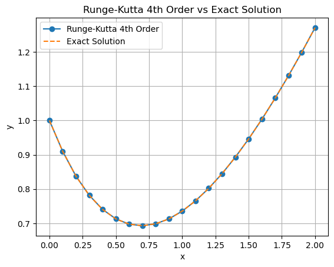
    


## Lab 9: Direct Methods for Solving Linear Systems​

Direct methods for solving linear systems are used for equations of the form:

$$
Ax = b
$$

Where $ A $ is a matrix, $ x $ is the unknown vector, and $ b $ is the known vector.


### Matrix Inversion Method for Solving Linear Systems

The matrix inversion method is a direct way of solving a linear system $Ax = b$. The idea is to compute the inverse of the matrix $A$ (if it exists), and then multiply it by the vector $b$ to find the solution:

$$
x = A^{-1}b
$$

Where:
- $A$ is the square matrix of coefficients.
- $x$ is the vector of unknowns.
- $b$ is the vector of constants.

#### Steps Involved
1. **Calculate the Inverse of $A$**: The inverse of a matrix $A$, denoted as $A^{-1}$, is a matrix such that when multiplied by $A$, it gives the identity matrix $I$:
   
   $$
   A^{-1}A = I
   $$

2. **Multiply the Inverse by $b$**: After computing $A^{-1}$, the solution $x$ can be obtained by multiplying it with the vector $b$:

   $$
   x = A^{-1}b
   $$

#### Considerations
- **Efficiency**: Computing the inverse of a matrix is computationally expensive and less efficient than other methods like LU decomposition or Gaussian elimination, especially for large matrices.
- **Numerical Stability**: Inverting a matrix can lead to numerical errors if the matrix is ill-conditioned (i.e., if it is close to being singular).
- **Existence of Inverse**: The matrix $A$ must be square (same number of rows and columns) and non-singular (its determinant must be non-zero) for the inverse to exist.

### Example 9.1

$$
3x + y = 9
$$
$$
x + 2y = 8
$$

Matrix \( A \):

$$
A = \begin{bmatrix}
3 & 1 \\
1 & 2
\end{bmatrix}
$$

Vector \( b \):

$$
b = \begin{bmatrix}
9 \\
8
\end{bmatrix}
$$


```python
import numpy as np

# Define the matrix A and vector b
A = np.array([[3, 1], [1, 2]])
b = np.array([9, 8])

# Compute the inverse of A
A_inv = np.linalg.inv(A)

# Compute the solution x
x = np.dot(A_inv, b)

print("Solution x:", x)
```

    Solution x: [2. 3.]
    

### Gaussian Elimination Method
Gaussian Elimination is a direct method for solving linear systems of equations. It transforms the system of equations into an upper triangular matrix, from which the solution can be easily obtained using back substitution.

The goal of Gaussian elimination is to manipulate the augmented matrix [𝐴∣𝑏] into a form where the matrix 𝐴 becomes upper triangular, which means all the elements below the main diagonal are zero.

#### Steps Involved in Gaussian Elimination:

##### 1. Forward Elimination:
- Use elementary row operations to transform the matrix into an upper triangular form.
- Eliminate the elements below the main diagonal (i.e., make all elements below the pivot to zero).

##### 2. Back Substitution:
- Once the matrix is in upper triangular form, solve for the unknowns starting from the last row and moving upward.


```python
import numpy as np

def gaussian_elimination(A, b):
    n = len(b)
    # Augmented matrix [A|b]
    Ab = np.hstack([A, b.reshape(-1, 1)])
    
    # Forward elimination
    for i in range(n):
        # Make the diagonal element 1 (pivoting)
        pivot = Ab[i, i]
        if pivot == 0:
            raise ValueError("Matrix is singular, cannot proceed with Gaussian elimination.")
        
        # Scale the row
        Ab[i] = Ab[i] / pivot
        
        # Eliminate the elements below the pivot
        for j in range(i + 1, n):
            scale = Ab[j, i]
            Ab[j] = Ab[j] - scale * Ab[i]
    
    # Back substitution
    x = np.zeros(n)
    for i in range(n - 1, -1, -1):
        x[i] = Ab[i, -1] - np.dot(Ab[i, i + 1:n], x[i + 1:])
    
    return x

# Define the matrix A and vector b
A = np.array([[3, 1], [1, 2]], dtype=float)
b = np.array([9, 8], dtype=float)

# Solve the system using Gaussian Elimination
x = gaussian_elimination(A, b)
print("Solution x:", x)
```

    Solution x: [2. 3.]
    

### Gaussian Elimination with Backward Substitution (Without Pivoting)

#### Steps Involved

##### 1. **Forward Elimination**:
- The goal of forward elimination is to convert the system of equations into an **upper triangular matrix**.
- This is achieved by using elementary row operations to make the elements below the main diagonal zero.

For a system $Ax = b$, we modify the augmented matrix $[A|b]$ in the following steps:
- Start with the first row and use it to eliminate the values below the first element (pivot).
- Move to the second row, use it to eliminate the value below it, and so on.

##### 2. **Back Substitution**:
- After forward elimination, the matrix is in upper triangular form.
- The solution can be found by starting from the last row and working upwards.
- Solve for the unknowns starting from the last equation, and then substitute those values into the previous equations to find the other unknowns.

### Example 9.2

Consider the system:

$$
A = \begin{bmatrix}
3 & 1 & 2 \\
1 & 2 & 3 \\
2 & 1 & 3
\end{bmatrix}, \quad
b = \begin{bmatrix}
9 \\
8 \\
7
\end{bmatrix}
$$

#### Step-by-Step Process:

1. **Form the augmented matrix**:

$$
\left[ A | b \right] = \begin{bmatrix}
3 & 1 & 2 & 9 \\
1 & 2 & 3 & 8 \\
2 & 1 & 3 & 7
\end{bmatrix}
$$

2. **Forward Elimination**:

- Eliminate the first column below the pivot (which is 3 in the first row):
    - Row 2: $R_2 \rightarrow R_2 - \frac{1}{3}R_1$
    - Row 3: $R_3 \rightarrow R_3 - \frac{2}{3}R_1$

Resulting matrix:

$$
\begin{bmatrix}
3 & 1 & 2 & 9 \\
0 & \frac{5}{3} & \frac{7}{3} & 5 \\
0 & \frac{1}{3} & \frac{5}{3} & 3
\end{bmatrix}
$$

- Eliminate the second column below the pivot (which is $\frac{5}{3}$ in the second row):
    - Row 3: $R_3 \rightarrow R_3 - \frac{1}{5}R_2$

Resulting matrix:

$$
\begin{bmatrix}
3 & 1 & 2 & 9 \\
0 & \frac{5}{3} & \frac{7}{3} & 5 \\
0 & 0 & 1 & 1
\end{bmatrix}
$$

3. **Back Substitution**:

Now that the matrix is in upper triangular form, we solve for the unknowns starting from the last row:

- From row 3: $x_3 = 1$
- From row 2: $\frac{5}{3}x_2 + \frac{7}{3}x_3 = 5$, substitute $x_3 = 1$ to solve for $x_2$.
- From row 1: $3x_1 + x_2 + 2x_3 = 9$, substitute $x_2$ and $x_3$ to solve for $x_1$.

The solution is obtained by back-substituting these values into the equations.

#### Considerations:

- **Numerical Stability**: This method can be numerically unstable when the matrix is ill-conditioned. Small round-off errors can propagate and affect the solution.
- **No Pivoting**: Without pivoting, there is no attempt to improve numerical stability by swapping rows. This method assumes that the leading entries (pivots) are non-zero and well-conditioned.
- **Singular Matrices**: If the matrix is singular (i.e., has a zero pivot), the algorithm will fail. Pivoting can help handle such cases.

This method works for small systems or when the matrix is well-conditioned. However, for larger systems or ill-conditioned matrices, using methods with pivoting or specialized algorithms like LU decomposition is recommended.


```python
import numpy as np

def gaussian_elimination_no_pivot(A, b):
    n = len(b)
    # Augmented matrix [A|b]
    Ab = np.hstack([A, b.reshape(-1, 1)])

    # Forward Elimination
    for i in range(n):
        for j in range(i + 1, n):
            if Ab[j, i] != 0:  # Avoid division by zero
                factor = Ab[j, i] / Ab[i, i]
                Ab[j] = Ab[j] - factor * Ab[i]

    # Back Substitution
    x = np.zeros(n)
    for i in range(n - 1, -1, -1):
        x[i] = (Ab[i, -1] - np.dot(Ab[i, i + 1:n], x[i + 1:])) / Ab[i, i]

    return x

# Example system of equations
A = np.array([[3, 1, 2], [1, 2, 3], [2, 1, 3]], dtype=float)
b = np.array([9, 8, 7], dtype=float)

# Solve the system using Gaussian elimination (no pivoting)
x = gaussian_elimination_no_pivot(A, b)
print("Solution x:", x)
```

    Solution x: [2. 3. 0.]
    

### LU Factorization and Solving a System of Linear Equations

LU Factorization is a technique for decomposing a square matrix $A$ into two matrices: $L$ (lower triangular matrix) and $U$ (upper triangular matrix). This method is useful for solving systems of linear equations.

#### Steps for LU Factorization and Solving $Ax = b$:

##### 1. LU Decomposition:
Decompose matrix $A$ into the product of a lower triangular matrix $L$ and an upper triangular matrix $U$.

The system $Ax = b$ is equivalent to:
$$
A = LU
$$
So, the equation becomes:
$$
LUx = b
$$
This can be split into two steps:
$$
Ly = b \quad \text{(where $y$ is an intermediate vector)}
$$
$$
Ux = y
$$
Thus, we need to solve two smaller systems.

##### 2. Forward Substitution (Solving $Ly = b$):
Since $L$ is lower triangular, we can solve for $y$ using forward substitution. This involves solving for each element of $y$ from top to bottom:
$$
y_1 = \frac{b_1}{L_{11}}
$$
$$
y_2 = \frac{b_2 - L_{21}y_1}{L_{22}}
$$
$$
\vdots
$$
Continue solving for each $y_i$.

##### 3. Backward Substitution (Solving $Ux = y$):
Since $U$ is upper triangular, we can solve for $x$ using backward substitution. This involves solving for each element of $x$ from bottom to top:
$$
x_n = \frac{y_n}{U_{nn}}
$$
$$
x_{n-1} = \frac{y_{n-1} - U_{n-1,n}x_n}{U_{n-1,n-1}}
$$
$$
\vdots
$$
Continue solving for each $x_i$.

##### 4. Final Solution:
Once you have solved for $y$ in the first step and $x$ in the second, you will have the solution to the system of equations $Ax = b$.

---


```python
import numpy as np

def lu_decomposition(A):
    """
    Perform LU Decomposition on matrix A.
    Returns the lower triangular matrix L and upper triangular matrix U.
    """
    n = A.shape[0]
    L = np.zeros_like(A)
    U = np.zeros_like(A)

    for i in range(n):
        # Upper triangular matrix
        for j in range(i, n):
            U[i, j] = A[i, j] - np.dot(L[i, :i], U[:i, j])
        
        # Lower triangular matrix
        for j in range(i, n):
            if i == j:
                L[i, i] = 1  # Diagonal elements of L are 1
            else:
                L[j, i] = (A[j, i] - np.dot(L[j, :i], U[:i, i])) / U[i, i]

    return L, U

def forward_substitution(L, b):
    """
    Solve Ly = b using forward substitution.
    """
    n = len(b)
    y = np.zeros_like(b, dtype=float)
    
    for i in range(n):
        y[i] = b[i] - np.dot(L[i, :i], y[:i])
    
    return y

def backward_substitution(U, y):
    """
    Solve Ux = y using backward substitution.
    """
    n = len(y)
    x = np.zeros_like(y, dtype=float)
    
    for i in range(n-1, -1, -1):
        x[i] = (y[i] - np.dot(U[i, i+1:], x[i+1:])) / U[i, i]
    
    return x

def solve_system(A, b):
    """
    Solve the system of linear equations Ax = b using LU decomposition.
    """
    # Step 1: Perform LU decomposition
    L, U = lu_decomposition(A)
    
    # Step 2: Solve Ly = b
    y = forward_substitution(L, b)
    
    # Step 3: Solve Ux = y
    x = backward_substitution(U, y)
    
    return x

# Example Usage
A = np.array([[4, 3], [6, 3]], dtype=float)
b = np.array([10, 12], dtype=float)

x = solve_system(A, b)

print("Solution vector x:")
print(x)

```

    Solution vector x:
    [1. 2.]
    

## Lab 10: Iterative Techniques in Matrix Algebra

### Jacobi Method for Solving Linear Systems

The **Jacobi method** is an iterative algorithm used to solve systems of linear equations of the form:

$$
A \cdot x = b
$$

Where:
- $A$ is the coefficient matrix,
- $b$ is the right-hand side vector, and
- $x$ is the solution vector that we want to find.

#### Jacobi Method Algorithm

The Jacobi method solves for each component of the vector $x$ using the equation:

$$
x_i^{(k+1)} = \frac{b_i - \sum_{j \neq i} A_{ij} \cdot x_j^{(k)}}{A_{ii}}
$$

Where:
- $x_i^{(k+1)}$ is the updated value of the $i$-th variable at the $(k+1)$-th iteration,
- $x_j^{(k)}$ are the values of all other variables from the previous iteration, and
- $b_i$ and $A_{ij}$ are the components of the right-hand side vector and coefficient matrix.

#### Convergence Criterion

The iteration stops when the difference between successive solutions is less than a predefined tolerance $\text{tol}$:

$$
\| x^{(k+1)} - x^{(k)} \|_{\infty} < \text{tol}
$$

Where $\| \cdot \|_{\infty}$ represents the infinity norm, which is the maximum absolute difference between the components of the two vectors.

---


```python
import numpy as np

def jacobi(A, b, x0=None, tol=1e-10, max_iter=1000):
    """
    Solve Ax = b using the Jacobi iterative method without using numpy.linalg.
    
    Parameters:
    A (ndarray): Coefficient matrix (n x n).
    b (ndarray): Right-hand side vector (n).
    x0 (ndarray): Initial guess for the solution (n). Default is None, which initializes to zeros.
    tol (float): Tolerance for convergence. Default is 1e-10.
    max_iter (int): Maximum number of iterations. Default is 1000.
    
    Returns:
    x (ndarray): Solution vector (n).
    """
    n = len(b)
    
    if x0 is None:
        x0 = np.zeros(n)
    
    x = np.copy(x0)
    for k in range(max_iter):
        x_new = np.zeros_like(x)
        
        for i in range(n):
            # Summation of A[i, j] * x[j] for all j != i
            summation = 0
            for j in range(n):
                if i != j:
                    summation += A[i, j] * x[j]
            x_new[i] = (b[i] - summation) / A[i, i]
        
        # Check for convergence (using infinity norm to check the change in x)
        max_diff = 0
        for i in range(n):
            max_diff = max(max_diff, abs(x_new[i] - x[i]))
        
        if max_diff < tol:
            print(f"Converged in {k + 1} iterations.")
            return x_new
        
        x = x_new
    
    print("Maximum iterations reached.")
    return x

# Example usage:
A = np.array([[4, -1, 0, 0],
              [-1, 4, -1, 0],
              [0, -1, 4, -1],
              [0, 0, -1, 3]], dtype=float)

b = np.array([15, 10, 10, 10], dtype=float)

# Initial guess can be omitted, and it defaults to zero vector
solution = jacobi(A, b)

print("Solution:", solution)

```

    Converged in 30 iterations.
    Solution: [5. 5. 5. 5.]
    

### Gauss-Seidel Method for Solving Linear Systems

The **Gauss-Seidel method** is an iterative algorithm used to solve systems of linear equations of the form:

$$
A \cdot x = b
$$

Where:
- $A$ is the coefficient matrix,
- $b$ is the right-hand side vector, and
- $x$ is the solution vector that we want to find.

#### Gauss-Seidel Method Algorithm

The Gauss-Seidel method improves on the Jacobi method by updating the solution vector $x$ in place as soon as new values are computed. The formula for the $i$-th component is:

$$
x_i^{(k+1)} = \frac{b_i - \sum_{j < i} A_{ij} \cdot x_j^{(k+1)} - \sum_{j > i} A_{ij} \cdot x_j^{(k)}}{A_{ii}}
$$

Where:
- $x_i^{(k+1)}$ is the updated value of the $i$-th variable at the $(k+1)$-th iteration,
- $x_j^{(k+1)}$ are the updated values of variables computed earlier in the same iteration, and
- $x_j^{(k)}$ are the values of variables from the previous iteration.

#### Convergence Criterion

The iteration stops when the difference between successive solutions is less than a predefined tolerance $\text{tol}$:

$$
\| x^{(k+1)} - x^{(k)} \|_{\infty} < \text{tol}
$$

Where $\| \cdot \|_{\infty}$ represents the infinity norm, which is the maximum absolute difference between the components of the two vectors.

---


```python
import numpy as np

def gauss_seidel(A, b, x0=None, tol=1e-10, max_iter=1000):
    """
    Solve Ax = b using the Gauss-Seidel iterative method without using numpy.linalg.
    
    Parameters:
    A (ndarray): Coefficient matrix (n x n).
    b (ndarray): Right-hand side vector (n).
    x0 (ndarray): Initial guess for the solution (n). Default is None, which initializes to zeros.
    tol (float): Tolerance for convergence. Default is 1e-10.
    max_iter (int): Maximum number of iterations. Default is 1000.
    
    Returns:
    x (ndarray): Solution vector (n).
    """
    n = len(b)
    
    if x0 is None:
        x0 = np.zeros(n)
    
    x = np.copy(x0)
    for k in range(max_iter):
        x_old = np.copy(x)
        
        for i in range(n):
            # Summation of A[i, j] * x[j] for all j != i
            summation = 0
            for j in range(n):
                if i != j:
                    summation += A[i, j] * x[j] if j < i else A[i, j] * x_old[j]
            x[i] = (b[i] - summation) / A[i, i]
        
        # Check for convergence (using infinity norm to check the change in x)
        max_diff = 0
        for i in range(n):
            max_diff = max(max_diff, abs(x[i] - x_old[i]))
        
        if max_diff < tol:
            print(f"Converged in {k + 1} iterations.")
            return x
    
    print("Maximum iterations reached.")
    return x

# Example usage:
A = np.array([[4, -1, 0, 0],
              [-1, 4, -1, 0],
              [0, -1, 4, -1],
              [0, 0, -1, 3]], dtype=float)

b = np.array([15, 10, 10, 10], dtype=float)

# Initial guess can be omitted, and it defaults to zero vector
solution = gauss_seidel(A, b)

print("Solution:", solution)
```

    Converged in 17 iterations.
    Solution: [5. 5. 5. 5.]
    
